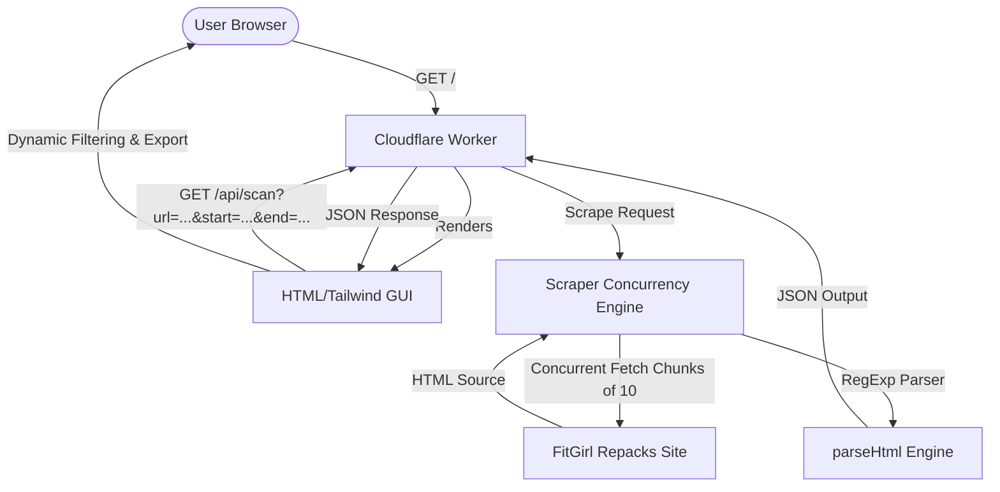

# 🕵️‍♀️ FitGirl Repacks Archive Scanner

A high-performance, concurrent web scraper and search interface designed as a Cloudflare Worker. This tool allows users to scan the FitGirl Repacks archive pages, parse metadata from entries (genres, developers, size, language, and links), filter/refine the results dynamically in real-time, and export the datasets as CSV.

Featuring a **Warm Editorial Cream Aesthetic** with interactive glassmorphism, native dark/light mode toggle, and micro-animations.

---

## ✨ Key Features

- **⚡ Cloudflare Worker Backend**: Lightweight, serverless deployment capable of handling API requests and serving the frontend from a single file.
- **🚀 Ultra-Fast Concurrent Scraping**: Fetches up to 10 pages concurrently using asynchronous chunking to maximize performance while minimizing execution time.
- **🛡️ Rate-Limit Avoidance**: Automatically applies small randomized delays (jitter) between requests in a concurrency batch to avoid hitting target web application firewalls (WAF) or rate limits.
- **🔍 Deep Metadata Extraction**: Utilizes optimized regular expressions to extract clean metadata fields:
  - **Title & URL**
  - **Genres / Tags**
  - **Companies** (Developers/Publishers)
  - **Languages** (Audio/Text support details)
  - **Original Game Size**
  - **Repack Size**
- **🎨 Warm Editorial GUI**:
  - Beautiful typographic hierarchy featuring **Fraunces** (serif for headings), **DM Sans** (clean sans-serif for body), and **JetBrains Mono** (for technical parameters).
  - Cream/Terracotta palette for Light mode, transitioning to an elegant Obsidian/Amber palette for Dark mode.
  - Interactive card hover translations and subtle micro-animations.
- **🔎 Real-time Search & Filter**:
  - Instant text-search against all metadata fields (titles, genres, companies, languages).
  - Repack size filter allowing query values such as `5 GB` or `800 MB` to dynamically filter games above/below sizes.
- **📋 Dual View Modes**: Toggle between a detail-rich **Grid View** (with individual card details) and a compact, scan-friendly **List View**.
- **📥 One-Click Export**: Download the filtered or full scraped results instantly as a standard `.csv` file directly from the browser.
- **📋 Copy-to-Clipboard**: Copy game page URLs directly to the clipboard with visual confirmation feedback.

---

## 🛠️ Tech Stack

- **Serverless Runtime**: Cloudflare Workers (ES Modules style)
- **Frontend Framework**: Tailwind CSS (Tailwind Play CDN for zero-build convenience)
- **Fonts**: DM Sans, Fraunces, JetBrains Mono (via Google Fonts)
- **Scraping & Requesting**: Native JS `fetch` API, RegExp-based parsing, concurrency chunking

---

## 📂 Project Structure

```
.
├── worker.js     # Core worker entry point (includes scraper logic, GUI renderer, and router)
└── README.md     # Project documentation
```

---

## ⚙️ How It Works (Architecture)



### 1. Request Routing
The Cloudflare Worker interceptor listens to incoming requests and routes them as follows:
- **`GET /`**: Serves the single-page GUI (`renderGUI()`).
- **`GET /api/scan`**: Accepts query parameters `url` (target archive URL), `start` (starting page number), and `end` (ending page number). Invokes the backend scraping handler.
- **Other routes**: Returns a `404 Not Found` response.

### 2. Concurrency Engine
To scrape multiple pages rapidly, `scrapePages()` processes requests in chunks:
```javascript
const concurrency = 10;
for (let i = 0; i < pages.length; i += concurrency) {
    const chunk = pages.slice(i, i + concurrency);
    const promises = chunk.map(async (pageNum) => {
        // Random human-like delay (jitter)
        await new Promise(resolve => setTimeout(resolve, Math.random() * 200));
        const response = await fetch(targetUrl, { headers });
        // Parse and return games
    });
    const results = await Promise.all(promises);
    allGames.push(...results.flat());
}
```

---

## 🚀 Getting Started (Local Development)

To run and test the scanner locally, you can use the Cloudflare Wrangler CLI.

### Prerequisites
Make sure you have [Node.js](https://nodejs.org/) installed.

### 1. Install Wrangler CLI globally (if not already installed)
```bash
npm install -g wrangler
```

### 2. Run the Worker in Development Mode
Execute Wrangler in the repository root directory:
```bash
npx wrangler dev worker.js
```
This starts a local development server (usually at `http://localhost:8787`). Open this URL in your browser to interact with the GUI.

---

## ☁️ Deployment to Cloudflare Workers

Deploying to Cloudflare is extremely simple and can be done via the command line.

### 1. Login to Cloudflare
```bash
npx wrangler login
```

### 2. Initialize a wrangler configuration (Optional, if you want a dedicated configuration file)
Create a `wrangler.toml` file in the root directory:
```toml
name = "fitgirl-extractor"
main = "worker.js"
compatibility_date = "2024-04-01"

[site]
bucket = "" # No static site assets required; GUI is self-contained in main.js
```

### 3. Deploy
```bash
npx wrangler deploy
```
Once deployed, Cloudflare will provide you with a production URL (e.g., `https://fitgirl-extractor.<your-subdomain>.workers.dev`).

---

## 📊 API Reference

### Scan Repacks Archive
Fetches repack posts from a range of pages and returns metadata.

- **Endpoint**: `/api/scan`
- **Method**: `GET`
- **Query Parameters**:
  - `url` (Required): The base archive URL of the site to scan (e.g. `https://fitgirl-repacks.site/2026/05/page/1/`).
  - `start` (Optional, default `1`): The starting page number.
  - `end` (Optional, default `1`): The ending page number.

- **Example Request**:
  `GET /api/scan?url=https%3A%2F%2Ffitgirl-repacks.site%2F2026%2F05%2F&start=1&end=5`

- **Example Response JSON**:
  ```json
  [
    {
      "url": "https://fitgirl-repacks.site/some-game-repack/",
      "title": "Some Game Name v1.0.0 + All DLCs",
      "genres": "RPG, Action, Open World",
      "companies": "Game Studio / Publisher",
      "languages": "ENG/FRA/GER/SPA",
      "originalSize": "45 GB",
      "repackSize": "12.3 GB"
    }
  ]
  ```

---

## 🔒 Disclaimer
This tool is for educational and personal archive curation purposes only. Ensure you respect the target website's Terms of Service and rate limits when querying. The author accepts no responsibility for misuse of this utility.

---
*Crafted with ❤️ by [pavnxet](https://pavnxet.github.io/)*